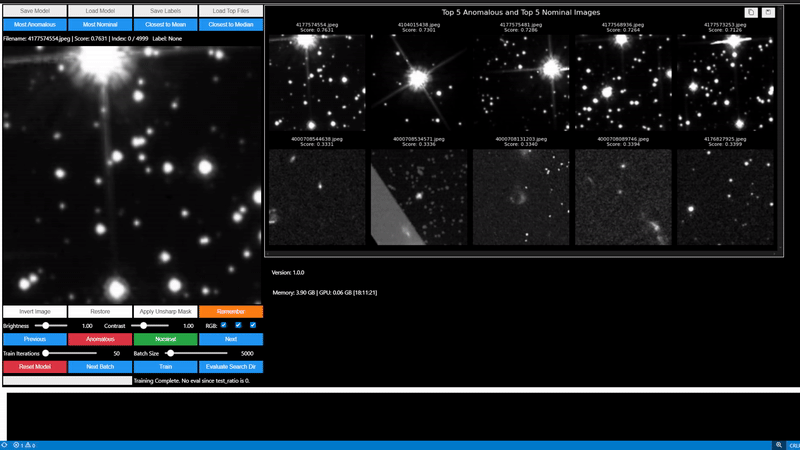
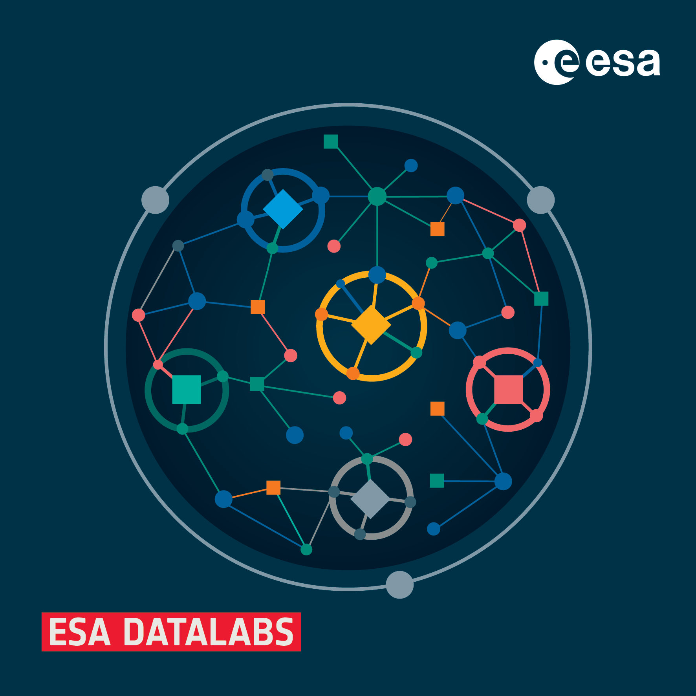

[//]: # (Copyright &#40;c&#41; European Space Agency, 2025.)
[//]: # ()
[//]: # (This file is subject to the terms and conditions defined in file 'LICENCE.txt', which)
[//]: # (is part of this source code package. No part of the package, including)
[//]: # (this file, may be copied, modified, propagated, or distributed except according to)
[//]: # (the terms contained in the file 'LICENCE.txt'.)
# AnomalyMatch
High-performance semi-supervised anomaly detection with active learning



## Table of Contents
- [AnomalyMatch](#anomalymatch)
  - [Table of Contents](#table-of-contents)
  - [Overview](#overview)
    - [Ecosystem](#ecosystem)
  - [Requirements](#requirements)
  - [Installation](#installation)
  - [Session Tracking](#session-tracking)
  - [Programmatic Evaluation (Headless Mode)](#programmatic-evaluation-headless-mode)
  - [Recommended Folder Structure](#recommended-folder-structure)
  - [Supported File Formats](#supported-file-formats)
    - [Zarr File Support](#zarr-file-support)
      - [Zarr File Requirements](#zarr-file-requirements)
      - [Creating Zarr Files](#creating-zarr-files)
      - [Zarr Configuration](#zarr-configuration)
      - [Multiple Zarr Files for Prediction](#multiple-zarr-files-for-prediction)
    - [FITS File Handling](#fits-file-handling)
    - [Multispectral Support](#multispectral-support)
    - [Cutana Streaming Integration](#cutana-streaming-integration)
  - [Normalisation and Stretching](#normalisation-and-stretching)
  - [Key Config Parameters](#key-config-parameters)
  - [Advanced CFG Parameters](#advanced-cfg-parameters)
    - [FixMatch Parameters](#fixmatch-parameters)
    - [Training Parameters](#training-parameters)
    - [Additional Parameters](#additional-parameters)
  - [Acknowledgements](#acknowledgements)

## Overview


This package uses a FixMatch pipeline built on EfficientNet models (via [timm](https://github.com/huggingface/pytorch-image-models)) and provides a mechanism
for active learning to detect anomalies in images. It also offers a GUI (in the separate `anomaly_match_ui` package) for labelling and managing the detection process, including the ability to unlabel previously labelled images.

AnomalyMatch is available plug-and-play on GPUs in [ESA Datalabs](https://datalabs.esa.int/), providing seamless access to high-performance computing resources for large-scale anomaly detection tasks.

For detailed information about the method and its applications, see our papers:
- [AnomalyMatch: Discovering Rare Objects of Interest with Semi-supervised and Active Learning](https://arxiv.org/abs/2505.03509) - describing the method in detail
- [Identifying Astrophysical Anomalies in 99.6 Million Cutouts from the Hubble Legacy Archive Using AnomalyMatch](https://arxiv.org/abs/2505.03508) - describing a scaled-up search through 100M cutouts European Space Agency, 2025.)

### Ecosystem

AnomalyMatch relies on two companion libraries for image loading and normalisation:

```
                ┌──────────────┐
                │ AnomalyMatch │
                └──┬───────┬───┘
      Training/    │       │  Streaming
      Prediction   │       │  Prediction
                   ▼       ▼
            ┌─────────┐ ┌────────┐
            │ fitsbolt │ │ cutana │
            └─────────┘ └───┬────┘
                 ▲           │
                 └───────────┘
              (normalisation)
```

- **[fitsbolt](https://github.com/esa/fitsbolt)** handles FITS/image loading and normalisation (stretching, channel combination, dtype conversion).
- **[Cutana](https://github.com/esa/cutana)** orchestrates cutout extraction from FITS tiles and delegates normalisation to fitsbolt.

Because both the training and Cutana streaming paths use fitsbolt for normalisation, results are guaranteed to be consistent.

## Requirements
Dependencies are listed in the `environment.yml` file. To leverage the full capabilities of 
this package (especially training on large images or predicting over large image datasets), a GPU is strongly recommended.
Use with Jupyter notebooks is recommended (see [StarterNotebook.ipynb](StarterNotebook.ipynb)) since the UI 
relies on ipywidgets.

## Installation

```bash
# Clone the repository
git clone https://github.com/ESA/AnomalyMatch.git
cd AnomalyMatch

# Create and activate conda environment from the environment.yml file
conda env create -f environment.yml
conda activate am

# Install the package (use -e for development mode)
pip install .
```

After installation, you can start using AnomalyMatch in your Jupyter notebooks. See [`StarterNotebook.ipynb`](StarterNotebook.ipynb) for an example.

## Session Tracking

AnomalyMatch automatically tracks comprehensive session information including training iterations, model checkpoints, labelled samples, and performance metrics. All session data is saved in organised directories under `anomaly_match_results/sessions/` with the structure:

```
session_name_timestamp/
├── session_metadata.json    # Complete session tracking data
├── labeled_data.csv         # All labelled samples
├── config.toml              # Final configuration
├── model.pth                # Model checkpoint
└── iteration_scores/        # Per-iteration prediction scores
    ├── iteration_1_unlabelled_scores.csv
    ├── iteration_1_test_scores.csv
    └── ...
```

**Iteration Scores:** After each training iteration, AnomalyMatch stores prediction scores for both unlabelled and test data (if `test_ratio > 0`). These CSV files contain filenames and their corresponding anomaly scores, enabling analysis of how predictions evolve across training iterations.

You can view any saved session using:
```python
import anomaly_match as am
am.print_session('/path/to/session/directory')
```

Session tracking is automatic and integrates seamlessly with existing workflows.

## Programmatic Evaluation (Headless Mode)

AnomalyMatch can be used without the UI for batch evaluation in scripts and automated pipelines. After training a model interactively (or loading a pretrained checkpoint), you can run predictions programmatically:

```python
import anomaly_match as am

cfg = am.get_default_cfg()
cfg.name = "batch_evaluation"

# Trained model checkpoint
cfg.model_path = "/path/to/model.pth"

# Directory containing images, HDF5, or Zarr files to evaluate
cfg.prediction_search_dir = "/path/to/images_to_evaluate"

# Training data dir and label file (required by Session initialisation —
# point to original training data or any dir with labelled + unlabelled images)
cfg.data_dir = "/path/to/training_images"
cfg.label_file = "/path/to/labeled_data.csv"

# Image size must match training
cfg.normalisation.image_size = [210, 210]

# Skip test set (not needed for batch prediction)
cfg.test_ratio = 0.0

am.set_log_level("info", cfg)

# Run evaluation
session = am.Session(cfg)
session.load_model()          # loads checkpoint and restores normalisation settings
session.evaluate_all_images(top_N=1000)
session.save_session()

# Results are saved as CSV + NPY in cfg.output_dir
print(f"Results saved to: {cfg.output_dir}")
print(f"Top score: {session.scores[0]:.4f} — {session.filenames[0]}")
```

**Notes:**
- `data_dir` and `label_file` are required because Session always initialises the training dataset. Point them to the original training data (or any directory with a few labelled + unlabelled images with the same channel count as the model).
- Normalisation settings are loaded from the model checkpoint during `load_model()`, so they don't need to be re-specified.
- `top_N` controls how many top-scoring images are retained. Results are saved as `{save_file}_top{top_N}.csv` (with `Filename` and `Score` columns) and a `.npy` file (images) in `cfg.output_dir`.
- For FITS files with multiple extensions, set `cfg.normalisation.fits_extension` (e.g., `[1, 2, 3]`).

## Recommended Folder Structure
- project/
  - labeled_data.csv | containing annotations of labelled examples
  - metadata.csv | containing metadata, e.g. sourceIDs, for images (optional)
  - training_images/ | the cfg.data_dir, can contain .jpeg, .jpg, .png, .fits, .tif, or .tiff files
    - image1.png
    - image2.png
  - data_to_predict/ | the cfg.prediction_search_dir
    - unlabeled_file_part1.hdf5
    - unlabeled_file_part2.hdf5
    - large_dataset.zarr
    - individual_images/
      - img001.jpg
      - img002.png

Example of a minimal labeled_data.csv:
```
filename,label,your_custom_source_id
image1.png,normal,123456
image2.png,anomaly,424242
```
Here, the additional columns (like "your_custom_source_id") can store your own identifiers or data.

Example of a metadata.csv:
```
filename,sourceID,ra,dec,custom_col
image1.png,source1,10.5,20.3,custom_value1
image2.png,source2,11.2,21.7,custom_value2
```

The metadata file can include optional columns for sourceID, ra, dec, and any custom columns you need. This metadata is automatically merged with the labelled data when saving results. Specify the metadata file with `cfg.metadata_file = "path/to/metadata.csv"`.

The `ra` and `dec` coordinates both have to be in degree and in the [ICRS frame](https://en.wikipedia.org/wiki/International_Celestial_Reference_System).

## Supported File Formats

AnomalyMatch supports the following image file formats:
- **Standard formats**: JPEG (*.jpg, *.jpeg), PNG (*.png), TIFF (*.tif, *.tiff)
- **Astronomical formats**: FITS (*.fits)
- **Container formats**: HDF5 (*.h5, *.hdf5), Zarr (*.zarr)

Note: If multiple filetypes are present, all will be loaded.

### Zarr File Support

AnomalyMatch supports Zarr files for efficient storage and processing of large image datasets. Zarr files are particularly useful for:
- Large collections of images that don't fit in memory
- Distributed and cloud-based workflows
- Efficient chunked access to image data

#### Zarr File Requirements

Zarr files must contain:
- An `images` dataset with shape `(N, height, width, channels)` where N is the number of images
- Optional metadata file (`.parquet` format) containing filenames

#### Creating Zarr Files

You can create compatible Zarr files using the [images_to_zarr](https://github.com/gomezzz/images_to_zarr/) utility, which converts collections of images into the Zarr format expected by AnomalyMatch.

Example workflow:
```bash
# Install images_to_zarr
pip install images_to_zarr
```

```python
# Convert a directory of images to 150x150 pixel zarr format
import images_to_zarr as i2z
i2z.convert(
    output_dir="path/to/output.zarr",
    folders="path/to/images", 
    resize=(150, 150), 
    chunk_shape=(1000, 4, 150, 150)  # 1000 images per chunk
)
```

For best performance, we recommend using chunks of 1000 images (`chunk_shape=(1000, channels, height, width)`).

The resulting Zarr file will contain:
- `/images`: The image array with proper chunking
- Associated metadata file with original filenames

#### Zarr Configuration

AnomalyMatch automatically detects and processes Zarr files in your prediction directory:
```python
cfg.prediction_search_dir = "/path/to/directory/containing/zarr/files"
```

AnomalyMatch will automatically discover all `.zarr` files in the specified directory and process them efficiently in parallel. Each Zarr file should contain image data with optional metadata in a corresponding `.parquet` file.

#### Multiple Zarr Files for Prediction

When running predictions on large datasets split across multiple Zarr files, AnomalyMatch automatically discovers and processes all Zarr stores in `prediction_search_dir`. Two folder structures are supported:

**Option 1: Direct Zarr files**
```
prediction_search_dir/
├── dataset_part1.zarr/
│   └── images/           # Zarr array with shape (N, H, W, C)
├── dataset_part1_metadata.parquet
├── dataset_part2.zarr/
│   └── images/
└── dataset_part2_metadata.parquet
```

**Option 2: Batch folders with images.zarr subdirectory**
```
prediction_search_dir/
├── batch_001/
│   ├── images.zarr/
│   │   └── images/
│   └── images_metadata.parquet
├── batch_002/
│   ├── images.zarr/
│   │   └── images/
│   └── images_metadata.parquet
```

**Metadata requirements:**
- Parquet files should contain a `filename`, `original_filename`, or `source_id` column
- For direct zarr files: `<zarr_name>_metadata.parquet` in the same directory
- For batch folders: `images_metadata.parquet` in the batch folder

**Filename handling:** To prevent collisions across zarr files, filenames are automatically prefixed with the zarr/batch folder name (e.g., `batch_001__image_000042`).

### FITS File Handling

- By default, the first extension (index 0) is used when loading FITS files
- You can specify a particular extension using the `fits_extension` parameter in the configuration:
  - Set `cfg.normalisation.fits_extension` in your code to control which FITS extensions to use
  - Integer values (e.g., `0`, `1`, `2`) to access extensions by index
  - String values (e.g., `"PRIMARY"`, `"SCIENCE"`) to access extensions by name
  - List of integers or strings (e.g., `[0, 1, 2]` or `["PRIMARY", "SCIENCE", "ERROR"]`) to combine multiple extensions
    into a single image. All specified extensions must have the same shape.
- Multi-dimensional data is handled automatically:
  - For data with more than 3 dimensions, only the first 3 dimensions are used
  - FITS data are normalised to the 0-255 range when loaded (uint8)
  - Channel order is automatically corrected if necessary
- When combining multiple extensions:
  - If extensions contain 2D data, they will be combined as channels (up to 3 for RGB)
  - If more than 3 extensions are provided for 2D data, only the first 3 will be used
  - All extensions must have identical dimensions to be combined

When working with FITS files containing multiple images or data products, specify which extension(s) to use in the configuration.

### Multispectral Support

AnomalyMatch supports training and prediction on images with arbitrary channel counts (1 to N channels), not just RGB (3 channels). This is useful for multispectral astronomical data.

**Configuration for N-channel images:**

```python
import anomaly_match as am

cfg = am.get_default_cfg()

# For FITS files with multiple extensions as channels
cfg.normalisation.fits_extension = ["VIS", "NIR-H", "NIR-J", "NIR-Y"]

# Asinh normalisation parameters (one per channel)
cfg.normalisation.norm_asinh_scale = [0.7, 0.7, 0.7, 0.7]
cfg.normalisation.norm_asinh_clip = [99.8, 99.8, 99.8, 99.8]
```

`n_output_channels` and `channel_combination` are automatically inferred from `fits_extension`: when multiple extensions are specified without an explicit `channel_combination`, an identity matrix is created and `n_output_channels` is set to match. Per-channel asinh parameters are also extended automatically if needed.

**Combining extensions into fewer channels with `channel_combination`:**

When you have more FITS extensions than desired output channels, use `channel_combination` to define a linear mapping. It is a NumPy array of shape `(n_output_channels, n_extensions)`. `n_output_channels` is automatically inferred from the matrix shape:

```python
import numpy as np

# 4 FITS extensions → 3 RGB output channels
cfg.normalisation.fits_extension = ["VIS", "NIR-H", "NIR-J", "NIR-Y"]
cfg.normalisation.channel_combination = np.array([
    [1, 0, 0, 0],    # R = VIS
    [0, 0.5, 0.5, 0], # G = average of NIR-H and NIR-J
    [0, 0, 0, 1],    # B = NIR-Y
])
```

Each row defines one output channel as a weighted sum of the input extensions. `n_output_channels` is set to the number of rows in the matrix. When `channel_combination` is `None` (default), an identity matrix is created automatically for multi-extension configs.

**Supported formats for N-channel data:**
- **NumPy arrays (`.npy`)**: Shape `(H, W, C)` where C is the number of channels
- **FITS files**: Multiple extensions combined as channels
- **HDF5/Zarr**: Arrays with shape `(N, H, W, C)`

**UI Channel Mapping:**

For images with more than 3 channels, the UI provides RGB mapping dropdowns to select which 3 channels to display as Red, Green, and Blue. This allows visual inspection of different channel combinations without affecting the training data.

**Model Architecture:**

When using pretrained models (default), AnomalyMatch automatically adapts the first convolutional layer for N-channel input:
- The first 3 channels use the pretrained RGB weights
- Additional channels are initialized with averaged RGB weights

This approach preserves the benefit of pretrained features while supporting arbitrary channel counts.

### Cutana Streaming Integration

AnomalyMatch supports streaming predictions via [Cutana](https://github.com/esa/cutana), which enables on-the-fly cutout extraction from FITS tiles. This is particularly useful for Euclid mission data, which Cutana primarily targets.

**How to use Cutana streaming:**

1. Prepare a Cutana-compatible source catalogue (CSV or Parquet) with columns for coordinates and FITS file paths
2. Set `cfg.prediction_search_dir` to a folder containing your catalogue files
3. AnomalyMatch will automatically detect the catalogues and stream cutouts via Cutana

**FITS extension configuration:** When using Cutana streaming, ensure `cfg.normalisation.fits_extension` matches the FITS extensions referenced in your catalogue. For multi-band Euclid data, this might be `["VIS", "NIR-H", "NIR-J"]` or similar, depending on your catalogue structure.

**Normalisation consistency:** AnomalyMatch automatically passes the same fitsbolt normalisation configuration to Cutana, so training and streaming prediction produce identically normalised images. If `channel_combination` is set, it is automatically translated to Cutana's expected format.

**Flux conversion:** Set `cfg.normalisation.apply_flux_conversion = True` when working with Euclid data to convert pixel values to flux density in Jansky using the AB zeropoint (`MAGZERO`) from FITS headers. This is applied consistently in both the training and Cutana prediction paths, before normalisation.

For more details on catalogue format and Cutana configuration, see the [Cutana documentation](https://github.com/esa/cutana).

## Normalisation and Stretching
- Normalisation can be selected in the UI via a drop-down. Alternatively it can be changed by setting e.g.
    `cfg.normalisation.normalisation_method = am.NormalisationMethod.ZSCALE`
- Current options are
    - `CONVERSION_ONLY`: no normalisation
    - `LOG`: [logarithmic normalisation](https://docs.astropy.org/en/stable/api/astropy.visualization.LogStretch.html#astropy.visualization.LogStretch)
    - `ZSCALE`: linear normalisation based on [zscale](https://docs.astropy.org/en/stable/api/astropy.visualization.ZScaleInterval.html) min and max.
    - `ASINH`: [Asinh](https://docs.astropy.org/en/stable/api/astropy.visualization.AsinhStretch.html) normalisation with configurable scale and percentile clipping for both grayscale/multichannel and RGB images.
- It currently allows an enum from [NormalisationMethod](anomaly_match/image_processing/NormalisationMethod.py) 
- Selecting a new [normalisation](anomaly_match/image_processing/normalisation.py) in the dropdown will apply it when training or predicting. For further detail see [Normalisation-Readme](anomaly_match/image_processing/Normalisationreadme.md)

**Normalisation Consistency:** Normalisation settings (method, channel combination, flux conversion, etc.) are saved in the model checkpoint during training. During prediction, these settings are loaded automatically from the checkpoint — there is no need to re-specify them. Both training and Cutana streaming use fitsbolt for normalisation, guaranteeing identical results.

**Flux Conversion:** For Euclid data, set `cfg.normalisation.apply_flux_conversion = True` to convert pixel values to flux density in Jansky using the AB zeropoint (`MAGZERO`) from FITS headers. This is applied consistently in both training and prediction paths.

## Key Config Parameters
- `save_dir`: Path to store the trained model output.
- `data_dir`: Location of the training data (*.jpeg, *.jpg, *.png, *.tif, or *.tiff).
- `label_file`: CSV mapping annotated images to labels.
- `metadata_file`: Optional CSV file containing metadata for images (automatically merged with labelled data).
- `prediction_search_dir`: Path where data to be predicted is stored.
- `logLevel`: Controls verbosity of training/session logs.
- `test_ratio`: Proportion of data used for evaluation (0.0 disables test evaluation, > 0 shows AUROC/AUPRC curves).
- `size`: Dimensions to which images are resized (below 96x96 is not recommended).
- `N_to_load`: Number of unlabeled images loaded into the training dataset at once. From this (`uratio`*`batch_size`*`num_train_iter`) (5*16*200) unlabeled images will be sampled for training.
- `output_dir`: Folder for storing results (e.g., labeled_data.csv or final logs).
- `prediction_batch_size`: Batch size for prediction. If not set, AnomalyMatch automatically estimates an optimal batch size based on available GPU memory.

## Advanced CFG Parameters

The following advanced parameters can be configured:

### FixMatch Parameters
- `ema_m`: Exponential moving average momentum (default: 0.99)
- `hard_label`: Whether to use hard labels for unlabelled data (default: True)
- `temperature`: Temperature for softmax in semi-supervised learning (default: 0.5)
- `ulb_loss_ratio`: Weight of the unlabeled loss (default: 1.0)
- `p_cutoff`: Confidence threshold for pseudo-labeling (default: 0.95)
- `uratio`: Ratio of unlabeled to labeled data in each batch (default: 5)

### Training Parameters
- `num_workers`: Number of parallel workers for data loading (default: 4)
- `batch_size`: Training batch size (default: 16)
- `lr`: Learning rate (default: 0.0075)
- `weight_decay`: L2 regularization parameter (default: 7.5e-4)
- `opt`: Optimizer type (default: "SGD")
- `momentum`: SGD momentum (default: 0.9)
- `bn_momentum`: Batch normalization momentum (default: 1.0 - ema_m)
- `num_train_iter`: Number of training iterations (default: 200)
- `eval_batch_size`: Batch size for evaluation (default: 500)
- `num_eval_iter`: Evaluation frequency, -1 means no evaluation (default: -1)
- `pretrained`: Whether to use pretrained backbone (default: True)
- `net`: Backbone network architecture (default: "efficientnet-lite0")

### Additional Parameters
- `fits_extension`: Extension(s) to use for FITS files, can be int, string, or list of int/string (default: None)
- `channel_combination`: NumPy array of shape `(n_output_channels, n_extensions)` defining how FITS extensions are linearly combined into output channels. When `None` (default), an identity matrix is auto-created for multi-extension configs. `n_output_channels` is inferred from the matrix shape when provided.
- `interpolation_order`: 0-5 corresponding to [skimage resize interpolation orders](https://scikit-image.org/docs/stable/api/skimage.transform.html#skimage.transform.warp) (default: 1 (Bi-linear))
- `normalisation_method`: Normalisation method to be applied during file loading. Can also be selected in the UI dropdown. Correspons to an entry from the class NormalisationMethod (default: `NormalisationMethod.CONVERSION_ONLY`)

## Acknowledgements

Thank you to all users who have provided feedback and helped us to make AnomalyMatch better. Your contributions help continue improving this tool for the scientific community.
