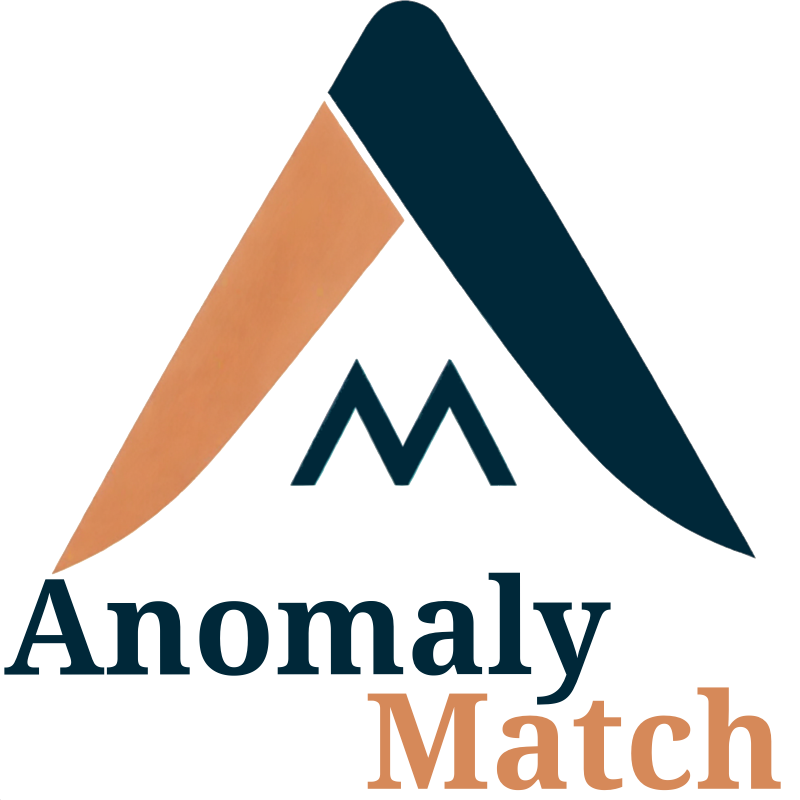
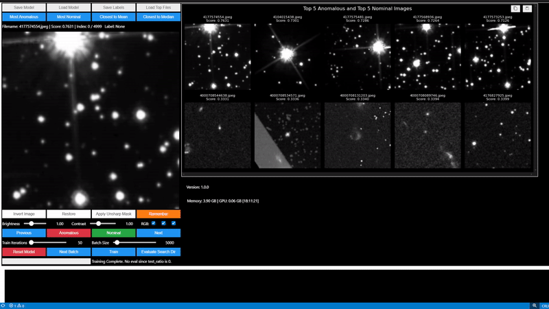
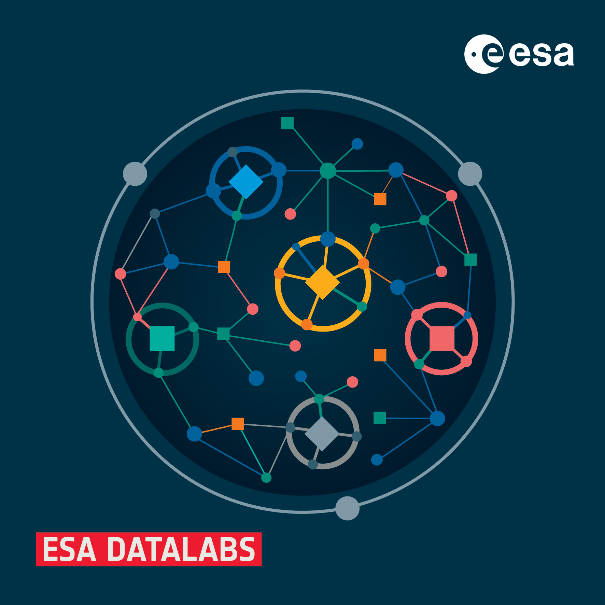

[//]: # (Copyright &#40;c&#41; European Space Agency, 2025.)
[//]: # ()
[//]: # (This file is subject to the terms and conditions defined in file 'LICENCE.txt', which)
[//]: # (is part of this source code package. No part of the package, including)
[//]: # (this file, may be copied, modified, propagated, or distributed except according to)
[//]: # (the terms contained in the file 'LICENCE.txt'.)
<p align="center">
  
</p>

# AnomalyMatch
High-performance semi-supervised anomaly detection with active learning

[](https://esa.github.io/AnomalyMatch/)



> 🤝 **Contributions are welcome!** See the [Contribution Guidelines](CONTRIBUTING.md) to get started.

## Overview


This package uses a FixMatch pipeline built on EfficientNet models (via [timm](https://github.com/huggingface/pytorch-image-models)) and provides a mechanism
for active learning to detect anomalies in images. It also offers a GUI (in the separate `anomaly_match_ui` package) for labelling and managing the detection process, including the ability to unlabel previously labelled images.

AnomalyMatch is available plug-and-play on GPUs in [ESA Datalabs](https://datalabs.esa.int/), providing seamless access to high-performance computing resources for large-scale anomaly detection tasks.

For detailed information about the method and its applications, see our papers:
- [AnomalyMatch: Discovering Rare Objects of Interest with Semi-supervised and Active Learning](https://arxiv.org/abs/2505.03509) - describing the method in detail
- [Identifying Astrophysical Anomalies in 99.6 Million Cutouts from the Hubble Legacy Archive Using AnomalyMatch](https://arxiv.org/abs/2505.03508) - describing a scaled-up search through 100M cutouts

### Ecosystem

AnomalyMatch relies on two companion libraries for image loading and normalisation:

```
                ┌──────────────┐
                │ AnomalyMatch │
                └──┬───────┬───┘
      Training/    │       │  Streaming
      Prediction   │       │  Prediction
                   ▼       ▼
            ┌─────────┐ ┌────────┐
            │ fitsbolt │ │ cutana │
            └─────────┘ └───┬────┘
                 ▲           │
                 └───────────┘
              (normalisation)
```

- **[fitsbolt](https://github.com/esa/fitsbolt)** handles FITS/image loading and normalisation (stretching, channel combination, dtype conversion).
- **[Cutana](https://github.com/esa/cutana)** orchestrates cutout extraction from FITS tiles and delegates normalisation to fitsbolt.

Because both the training and Cutana streaming paths use fitsbolt for normalisation, results are guaranteed to be consistent.

## Requirements
Dependencies are listed in the `environment.yml` file. To leverage the full capabilities of
this package (especially training on large images or predicting over large image datasets), a GPU is strongly recommended.
Use with Jupyter notebooks is recommended (see [StarterNotebook.ipynb](StarterNotebook.ipynb)) since the UI
relies on ipywidgets.

## Installation

```bash
# Clone the repository
git clone https://github.com/esa/AnomalyMatch.git
cd AnomalyMatch

# Create and activate conda environment from the environment.yml file
conda env create -f environment.yml
conda activate am

# Install the package (use -e for development mode)
pip install .
```

## Quick Start

After installation, open a Jupyter notebook and run:

```python
from anomaly_match_ui import start_ui

start_ui()
```

See [`StarterNotebook.ipynb`](StarterNotebook.ipynb) for a ready-to-run example.

### Label File

Labels are stored as a CSV with `id,label` columns:

```csv
id,label
image1.png,normal
image2.png,anomaly
```

The `id` is the source identifier: filename for image folders, SourceID for Cutana catalogues, or, for Zarr, the name from the store's parquet metadata sidecar (`original_filename`, `filename` or `source_id`), falling back to `<store>__image_NNNNNN`. Extra columns are ignored.

For Zarr and Cutana sources, labeled cutouts are cached next to the label CSV — e.g. for `/data/labels.csv` the cache lives at `/data/labels_cache/`. This persists across sessions so large Cutana builds aren't re-streamed every time. If the label CSV's parent directory isn't writable, the cache falls back to the session output directory. Delete the `*_cache/` folder to force a rebuild.

### Cutana Catalogue Channels

> **Train and predict on the same catalogue.** Otherwise the prediction catalogue must list the same bands, in the same order, with the same filter naming.

The `fits_file_paths` column defines the channels: one mosaic path per band, mapped to the model's inputs **by position**. Editing those paths changes what the model sees and AnomalyMatch cannot detect it — reordering paths or swapping in a different mosaic keeps the band count valid, so prediction silently runs on the wrong channels. Only a change in band *count* raises an error.

- If mosaics move on disk, rewrite the path prefix only — never the number, order, or filter identity of the entries.
- Check the band names in the normalisation panel before starting a run.
- After any path change, delete the labeled cache (`*_cache/`) and retrain.

See [Prediction](https://esa.github.io/AnomalyMatch/user-guide/prediction/) for details.

## Documentation

For comprehensive guides and API reference, see the **[full documentation](https://esa.github.io/AnomalyMatch/)**.

- [Getting Started](https://esa.github.io/AnomalyMatch/getting-started/) - folder structure, session tracking
- [Configuration](https://esa.github.io/AnomalyMatch/user-guide/configuration/) - all config parameters, normalisation methods
- [Training](https://esa.github.io/AnomalyMatch/user-guide/training/) - active-learning loop, choosing iterations, source-size stratification
- [Prediction](https://esa.github.io/AnomalyMatch/user-guide/prediction/) - file formats, Zarr, FITS, multispectral, Cutana streaming
- [Headless Mode](https://esa.github.io/AnomalyMatch/user-guide/headless/) - train and score from a script, without the UI
- [API Reference](https://esa.github.io/AnomalyMatch/api/anomaly_match/pipeline/session/) - auto-generated from docstrings

## Paper Reproduction

The benchmark and plotting scripts used in the AnomalyMatch papers are
available in
[`paper_scripts`](https://github.com/esa/AnomalyMatch/tree/v1.3.2/paper_scripts)
at the v1.3.2 release. Note that these scripts depend on an older Session API and are
not compatible with the current version.

## Acknowledgements

Thank you to all users who have provided feedback and helped us to make AnomalyMatch better. Your contributions help continue improving this tool for the scientific community.
