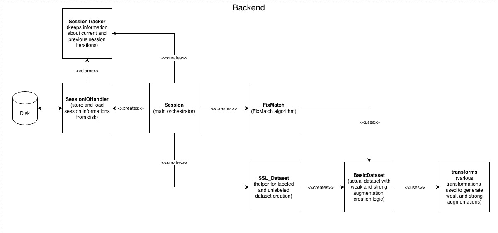

[//]: # (Copyright &#40;c&#41; European Space Agency, 2025.)
[//]: # ()
[//]: # (This file is subject to the terms and conditions defined in file 'LICENCE.txt', which)
[//]: # (is part of this source code package. No part of the package, including)
[//]: # (this file, may be copied, modified, propagated, or distributed except according to)
[//]: # (the terms contained in the file 'LICENCE.txt'.)

# Architecture

## Overview

AnomalyMatch separates **backend** (ML pipeline) from **frontend** (Jupyter UI):

```
anomaly_match/          Core ML library (models, datasets, pipeline, I/O)
anomaly_match_ui/       Jupyter UI (screens, widgets, BackendInterface)
subprocess_scripts/     Prediction & training subprocesses
```

The `BackendInterface` acts as a single gateway between UI and backend —
all session operations are accessible without the UI for headless or scripted
use (see [Headless Mode](user-guide/headless.md)).

## Ecosystem

AnomalyMatch relies on two companion libraries for image loading and
normalisation:

```
                ┌──────────────┐
                │ AnomalyMatch │
                └──┬────────┬──┘
      Training/    │        │  Streaming
      Prediction   │        │  Prediction
                   ▼        ▼
            ┌──────────┐ ┌────────┐
            │ fitsbolt │ │ cutana │
            └──────────┘ └───┬────┘
                 ▲           │
                 └───────────┘
              (normalisation)
```

- **[fitsbolt](https://github.com/lasloruhberg/fitsbolt)** handles FITS/image
  loading and normalisation (stretching, channel combination, dtype
  conversion).
- **[Cutana](https://github.com/esa/cutana)** orchestrates cutout extraction
  from FITS tiles and delegates normalisation to fitsbolt.

Because the training and Cutana streaming paths both normalise through
fitsbolt, a source scored by streaming prediction is normalised exactly as it
would have been in training.

## Core Components

| Component | Module | Purpose |
|-----------|--------|---------|
| Session | `anomaly_match.pipeline.session` | Orchestrates workflow: dataset, model, training |
| FixMatch | `anomaly_match.models.FixMatch` | Semi-supervised learning with dual-model EMA |
| SSL_Dataset | `anomaly_match.datasets.SSL_Dataset` | Labeled/unlabeled data separation |
| BackendInterface | `anomaly_match_ui.utils.backend_interface` | UI-session decoupling layer |
| AnomalyScoreDB | `anomaly_match.prediction.AnomalyScoreDB` | SQLite store for prediction scores |
| Transforms | `anomaly_match.image_processing.transforms` | Weak/strong/prediction augmentations |

## Data Flow

### Training (subprocess)

```
Config pickle + labels CSV  ->  subprocess_scripts/training_process.py
                                    -> SSL_Dataset -> FixMatch.train()
                                    -> Save model checkpoint
```

### Scoring / Prediction (subprocess)

```
Config pickle  ->  subprocess_scripts/prediction_process.py
                       -> batch inference -> AnomalyScoreDB
```

### Active Learning Cycle

```
TrainingSetupScreen -> [config + labels]
    -> Training subprocess -> model checkpoint
    -> Scoring subprocess  -> AnomalyScoreDB
    -> Gallery UI (browse, label via 3-way toggles)
    -> Merge labels into CSV -> [retrain]
```

## UI Screens

| Screen | Purpose |
|--------|---------|
| MainMenuScreen | Entry point with Training / Prediction buttons |
| TrainingSetupScreen | Select source folder, labels, model, normalisation |
| TrainingScreen | State machine: TRAINING -> SCORING -> BROWSING -> RETRAIN |
| PredictionSetupScreen | Select search folder, model, normalisation |
| PredictionScreen | Live prediction monitoring with gallery |
| ImageDetailScreen | Full-size image viewer with transform controls |

## Design Patterns

- **Subprocess architecture**: Training and scoring run as isolated child processes for memory safety and UI responsiveness. Progress is monitored via JSON-lines files (training) or database polling (scoring).
- **BackendInterface**: Static class wrapping all Session methods. UI components never import Session directly. Enables headless operation and testing.
- **GalleryScreenBase ABC**: Shared base class for PredictionScreen and TrainingScreen. Provides DB polling, pagination, sort, histogram, and image prefetch infrastructure.
- **Dual Model**: `train_model` (backprop) + `eval_model` (EMA) for stable predictions.
- **DB-backed gallery**: Large datasets loaded on-demand via AnomalyScoreDB queries and ImageCache, not in-memory arrays.
- **Session Persistence**: State saved to `anomaly_match_results/sessions/{name}_{timestamp}/`.

## Architecture diagram

<!-- The XML draw.io file is located @ ./assets/AnomalyMatchArchDiagram.drawio -->
