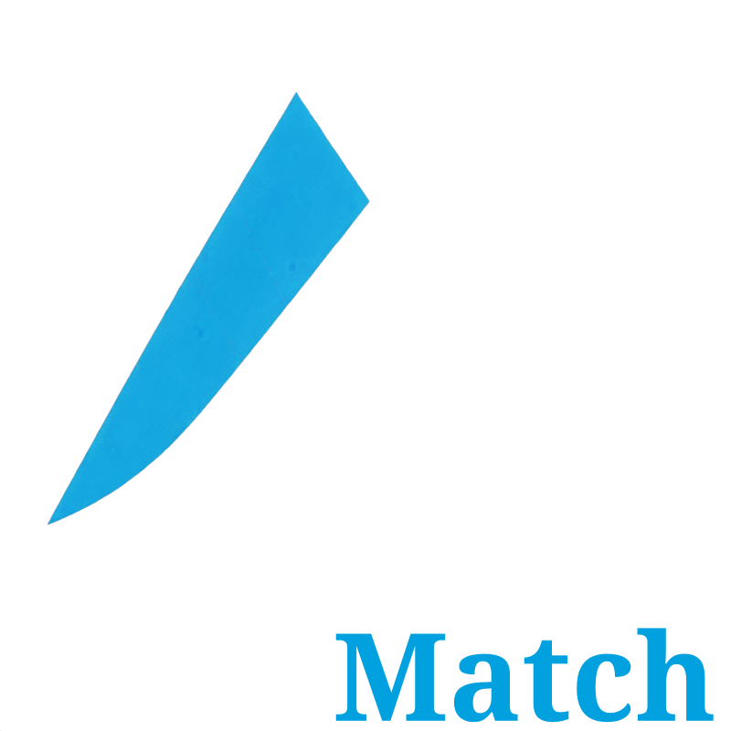

[//]: # (Copyright &#40;c&#41; European Space Agency, 2025.)
[//]: # ()
[//]: # (This file is subject to the terms and conditions defined in file 'LICENCE.txt', which)
[//]: # (is part of this source code package. No part of the package, including)
[//]: # (this file, may be copied, modified, propagated, or distributed except according to)
[//]: # (the terms contained in the file 'LICENCE.txt'.)

  

# AnomalyMatch

**Semi-supervised anomaly detection for astronomical images.**

AnomalyMatch uses the FixMatch algorithm with active learning to detect anomalies in astronomical image datasets. Starting from as few as 5-10 labeled examples, it achieves AUROC of 0.96 on miniImageNet and 0.89 on GalaxyMNIST. It provides a Jupyter notebook interface with ipywidgets for interactive labeling and model training.

## Key Features

- **Semi-supervised learning** with the [FixMatch](https://arxiv.org/abs/2001.07685) algorithm
- **Active learning** loop: predict, label, retrain
- **Multi-format support**: JPEG, PNG, FITS, Zarr with normalisation via [fitsbolt](https://github.com/lasloruhberg/fitsbolt)
- **Multispectral support**: N-channel astronomical images
- **Streaming prediction** via [Cutana](https://github.com/esa/cutana) for large-scale cutout extraction from FITS tiles
- **Interactive UI** for Jupyter notebooks with ipywidgets

## Available on ESA Datalabs

AnomalyMatch is available plug-and-play on GPUs in [ESA Datalabs](https://datalabs.esa.int/), providing seamless access to high-performance computing resources for large-scale anomaly detection tasks.

## Quick Links

- [Getting Started](getting-started.md) - Installation, folder structure, sessions
- [Method](method.md) - How AnomalyMatch works
- [Architecture](architecture.md) - System design overview
- [User Guide](user-guide/training.md) - Training and prediction workflows
- [Headless Mode](user-guide/headless.md) - Train and score from a script, without the UI
- [API Reference](api/anomaly_match/pipeline/session.md) - Module documentation

## License

AnomalyMatch is distributed under the **European Space Agency Public License (ESA-PL) Permissive – v2.4**. This is a permissive open-source license that allows use, modification, and redistribution of the software. See the full [LICENSE.txt](https://github.com/esa/AnomalyMatch/blob/main/LICENSE.txt) for details.

## Citing AnomalyMatch

If AnomalyMatch proves useful in your research, please cite our paper:

> Gomez, P., Ruhberg, L. E., Nardone, M. T., & O'Ryan, D. (2025). *AnomalyMatch: Discovering Rare Objects of Interest with Semi-supervised and Active Learning.* [arXiv:2505.03509](https://arxiv.org/abs/2505.03509)

See also the [CITATION.cff](https://github.com/esa/AnomalyMatch/blob/main/CITATION.cff) file for machine-readable citation metadata.
