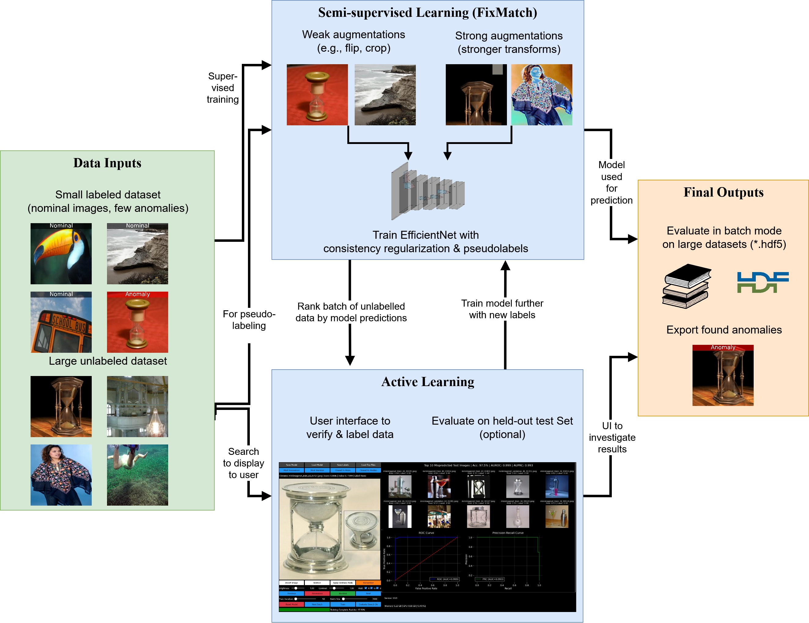
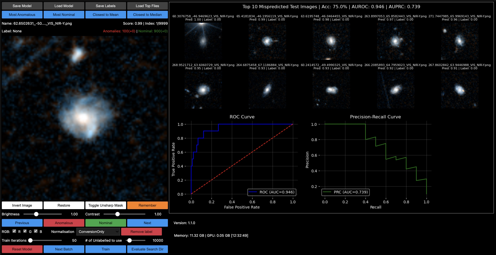
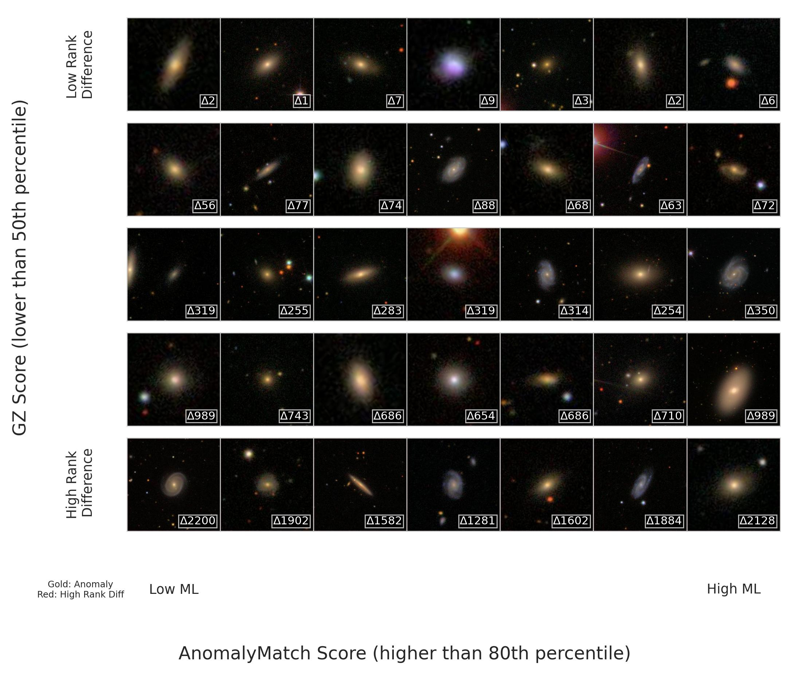
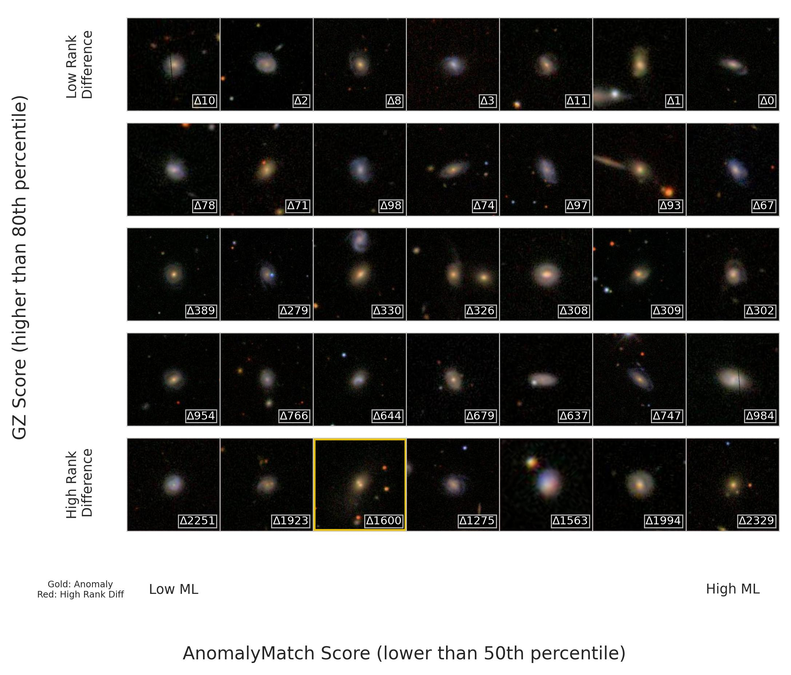

[//]: # (Copyright &#40;c&#41; European Space Agency, 2025.)
[//]: # ()
[//]: # (This file is subject to the terms and conditions defined in file 'LICENCE.txt', which)
[//]: # (is part of this source code package. No part of the package, including)
[//]: # (this file, may be copied, modified, propagated, or distributed except according to)
[//]: # (the terms contained in the file 'LICENCE.txt'.)

# Method

AnomalyMatch combines the semi-supervised **FixMatch** algorithm with **active learning** to detect anomalies starting from as few as 5-10 labeled examples.

For full details, see the paper: [AnomalyMatch: Discovering Rare Objects of Interest with Semi-supervised and Active Learning](https://arxiv.org/abs/2505.03509) (Gomez et al., 2025).



## Semi-supervised Learning with FixMatch

AnomalyMatch treats anomaly detection as binary classification ("normal" vs "anomaly") under severe class imbalance. The key insight is leveraging large amounts of **unlabeled** data alongside a small labeled set through FixMatch's consistency regularization.

### Augmentation Strategy

FixMatch applies two levels of augmentation to unlabeled images:

- **Weak augmentations**: Minor transformations (horizontal flips, slight random crops) that preserve image content — used to generate reliable pseudo-labels
- **Strong augmentations**: Aggressive transformations including rotations, colour distortions, sharpness variations, shearing, and posterisation — used to train the model to be invariant

### Pseudo-labels and Consistency Regularization

1. An unlabeled image receives a **weak augmentation** and is passed through the model
2. If the predicted probability exceeds a confidence threshold (default: 0.95), a pseudo-label is assigned
3. The **same image** receives a **strong augmentation** and is passed through the model again
4. The model is trained to match its prediction on the strongly-augmented image to the pseudo-label

This enforces prediction consistency across transformations, enabling the model to learn from unlabeled data.

### Loss Function

The total loss combines supervised and unsupervised components:

**L = L_sup + L_unsup**

- **L_sup**: Binary cross-entropy on the labeled data
- **L_unsup**: Consistency loss between pseudo-labels (from weak augmentation) and predictions (from strong augmentation)

### Dual-model Architecture

AnomalyMatch maintains two copies of the network:

- **Train model**: Updated via backpropagation
- **Eval model**: Updated via exponential moving average (EMA) of the train model's weights (momentum = 0.99)

The EMA model produces more stable predictions and is used for inference and pseudo-label generation.

## Active Learning Loop

The active learning cycle allows iterative refinement with minimal human effort:

1. **Train** the model on the current labeled set + unlabeled data (semi-supervised)
2. **Predict** anomaly scores on all unlabeled data
3. **Review** the top-ranked predictions in the interactive UI — verify discoveries and correct false positives
4. **Retrain** with the expanded labeled set
5. **Repeat** for 2-3 cycles

The number of labels added per cycle is entirely up to the user — the model improves with each additional label.



## Results

### Benchmark Performance

Starting from just 5-10 labeled anomalies and after 3 active learning cycles:

| Dataset | AUROC | AUPRC | Top 1% Precision |
|---------|-------|-------|-------------------|
| miniImageNet (1% anomaly ratio) | 0.96 | 0.82 | 76% |
| GalaxyMNIST (25% anomaly ratio) | 0.89 | 0.77 | 94% |
| Galaxy Zoo (0.9 voter threshold) | 0.91 | 0.17 | 25% |

### Anomaly Discovery on Galaxy Zoo

The figures below show AnomalyMatch scores vs Galaxy Zoo citizen science scores after 3 active learning iterations on the Galaxy Zoo dataset. Gold borders indicate true anomalies, and the rank difference (delta) shows how much AnomalyMatch's ranking differs from the crowd-sourced ranking.

**High anomaly scores (top predictions)** — the model identifies visually distinctive galaxies:



**Low anomaly scores (bottom predictions)** — the model correctly assigns low scores to common galaxy morphologies:



### Key Findings

- **100 iterations per cycle** is optimal — more iterations lead to overfitting on the small labeled set
- Performance is robust across 100-1000 initial labels with diminishing returns beyond 500
- A **weighted random sampler** addresses class imbalance by oversampling the minority (anomaly) class
- ImageNet-pretrained EfficientNet backbone provides strong transfer learning for both natural and astronomical images

## Citing AnomalyMatch

If you find AnomalyMatch useful in your research, please cite:

```bibtex
@article{gomez2025anomalymatch,
  title={AnomalyMatch: Discovering Rare Objects of Interest with Semi-supervised and Active Learning},
  author={G{\'o}mez, Pablo and Ruhberg, Laslo E. and Nardone, Maria Teresa and O'Ryan, David},
  journal={arXiv e-prints},
  year={2025},
  month={5},
  doi={10.48550/arXiv.2505.03509},
  url={https://arxiv.org/abs/2505.03509}
}
```
